<!--
███████╗███████╗ ██████╗     ██████╗ ██████╗  ██████╗ ███████╗██╗██╗     ███████╗
██╔════╝██╔════╝██╔═══██╗    ██╔══██╗██╔══██╗██╔═══██╗██╔════╝██║██║     ██╔════╝
███████╗█████╗  ██║   ██║    ██████╔╝██████╔╝██║   ██║█████╗  ██║██║     █████╗  
╚════██║██╔══╝  ██║   ██║    ██╔═══╝ ██╔══██╗██║   ██║██╔══╝  ██║██║     ██╔══╝  
███████║███████╗╚██████╔╝    ██║     ██║  ██║╚██████╔╝██║     ██║███████╗███████╗
╚══════╝╚══════╝ ╚═════╝     ╚═╝     ╚═╝  ╚═╝ ╚═════╝ ╚═╝     ╚═╝╚══════╝╚══════╝
-->

<!-- ══════════════════ HEADER BANNER ══════════════════ -->
<div align="center">
  
</div>

<br/>

<!-- ══════════════════ NAME & TYPING ANIMATION ══════════════════ -->
<div align="center">

<a href="https://github.com/ThilinaUdara">
  
</a>

<br/><br/>

<!-- Profile Views & Social Badges -->
<a href="https://github.com/ThilinaUdara">
  
</a>
<a href="https://www.linkedin.com/in/thilina-udara-859b35279/">
  
</a>
<a href="mailto:thilinaudarad@gmail.com">
  
</a>


</div>

<br/>

---

<!-- ══════════════════ ABOUT ME ══════════════════ -->


### `$ whoami` &nbsp; 🧑‍💻

```yaml
name       : Thilina Udara
location   : 🇱🇰 Sri Lanka
education  : BSc (Hons) Information Technology
university : SLIIT — Year 3
role       : Aspiring DevOps Engineer
passion    : Bridging Dev & Ops with AI ♾️
```

```yaml
currently_learning:
  - ♾️  Docker · Kubernetes · Jenkins · Linux
  - ⚡  MERN Stack · Spring Boot · React.js
  - 🤖  LLM Integration · Gemini · Claude · Ollama

mission: >
  Building scalable infrastructure &
  intelligent full-stack systems that
  actually make a difference 🌟

philosophy:
  code           : Clean, efficient & maintainable
  infrastructure : Automated, secure & resilient
  innovation     : AI-powered smart workflows

available_for   : DevOps Internships 🌍
work_style      : Agile · Team Lead · Continuous Learner
```

<br clear="right"/>

---

<!-- ══════════════════ TECH STACK ══════════════════ -->

<h2 align="center">⚙️ &nbsp; Technology Arsenal</h2>

<div align="center">

### 🌐 Frontend Mastery


### ⚡ Backend Engineering


### 🗄️ Databases


### 🤖 AI & Machine Learning


### ☁️ Cloud & DevOps


### 🛠️ Development Tools


</div>

---

<!-- ══════════════════ GITHUB STATS ══════════════════ -->

<h2 align="center">📊 &nbsp; GitHub Analytics</h2>

<div align="center">
  
  
</div>

<br/>

<!-- Streak Stats -->
<div align="center">
  
</div>

<br/>

<!-- Activity Graph -->
<div align="center">
  
</div>

---

<!-- ══════════════════ FEATURED PROJECTS ══════════════════ -->

<h2 align="center">🚀 &nbsp; Featured Projects</h2>

<div align="center">

<a href="https://github.com/ThilinaUdara">
  
</a>
<a href="https://github.com/ThilinaUdara">
  
</a>

</div>

<br/>

<!-- Project Cards (Manual) -->
<table align="center" width="100%">
  <tr>
    <td width="50%" valign="top">
      <h3>🧠 UniPlan</h3>
      <p>AI-powered student productivity & schedule management system. Smart planning meets academic workflow automation.</p>
      
      
      
    </td>
    <td width="50%" valign="top">
      <h3>🏙️ Smart Campus Hub</h3>
      <p>Campus Operation Hub with strict Git branch protection workflows & CI/CD pipelines for collaborative development.</p>
      
      
      
    </td>
  </tr>
  <tr>
    <td width="50%" valign="top">
      <h3>✅ Taskify</h3>
      <p>Full-stack, containerized task management app. Built with JavaScript & Docker — production-ready from day one.</p>
      
      
      
    </td>
    <td width="50%" valign="top">
      <h3>💰 Coinomy</h3>
      <p>Personal finance tracker app developed in Kotlin. Beautiful native Android experience for smarter money habits.</p>
      
      
      
    </td>
  </tr>
</table>

---

<!-- ══════════════════ CONTRIBUTION SNAKE ══════════════════ -->

<h2 align="center">🐍 &nbsp; Contribution Graph</h2>

<div align="center">
  
</div>

> **💡 To generate your own Pacman/Snake animation:**  
> Add this GitHub Action to `.github/workflows/pacman.yml` → it auto-generates on every push!

---

<!-- ══════════════════ RANDOM DEV QUOTE ══════════════════ -->

<div align="center">
  
</div>

---

<!-- ══════════════════ TROPHIES ══════════════════ -->

<h2 align="center">🏆 &nbsp; GitHub Trophies</h2>

<div align="center">
  
</div>

---

<!-- ══════════════════ WAVE FOOTER ══════════════════ -->

<div align="center">

```
╔══════════════════════════════════════════════════════════════════╗
║                                                                  ║
║   "First, solve the problem. Then, write the code."             ║
║                                            — John Johnson        ║
║                                                                  ║
╚══════════════════════════════════════════════════════════════════╝
```

### 🤝 &nbsp; Let's Connect & Build Something Amazing!

<a href="https://www.linkedin.com/in/thilina-udara-859b35279/">
  
</a>
&nbsp;
<a href="mailto:thilinaudarad@gmail.com">
  
</a>
&nbsp;
<a href="https://github.com/ThilinaUdara">
  
</a>

<br/><br/>


</div>

<!-- 
════════════════════════════════════════════════
📁 ASSETS SETUP — Place these files in /assets/:
  - pixel-coding.gif  (the pixel art gaming room gif)
  - lofi-coding.gif   (the lofi anime coding gif)
  - Pacman.svg        (the pacman contribution graph)
════════════════════════════════════════════════
⚙️  REPLACE ThilinaUdara with your actual GitHub username
════════════════════════════════════════════════
-->
