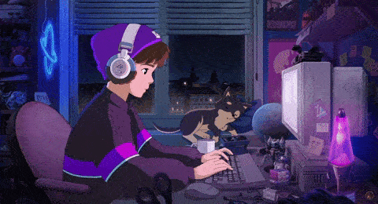

<!--
╔═══════════════════════════════════════════════════════════╗
║          THILINA UDARA — GITHUB PROFILE README            ║
║              🎮 Solo Leveling Dark Theme 🎮               ║
╚═══════════════════════════════════════════════════════════╝

SEO Keywords: DevOps Engineer Sri Lanka, SLIIT IT Student,
Full Stack Developer, MERN Stack, Docker Kubernetes,
AI Integration, Spring Boot, React Developer, Open to Internship
-->

<!-- ══════════════════ TOP WAVE HEADER ══════════════════ -->


<!-- ══════════════════ PIXEL ART BANNER ══════════════════ -->
<div align="center">
  
</div>

<br/>

<!-- ══════════════════ TYPING ANIMATION ══════════════════ -->
<div align="center">

<a href="https://github.com/ThilinaUdara">
  
</a>

<br/><br/>

<!-- Badge Row -->
<a href="https://github.com/ThilinaUdara">
  
</a>
&nbsp;
<a href="https://www.linkedin.com/in/thilina-udara-859b35279/" title="Thilina Udara on LinkedIn">
  
</a>
&nbsp;
<a href="mailto:thilinaudarad@gmail.com" title="Email Thilina Udara">
  
</a>
&nbsp;

&nbsp;


</div>

<br/>

<!-- ══════════════════ DIVIDER ══════════════════ -->


<!-- ══════════════════ ABOUT ME ══════════════════ -->

<table width="100%">
<tr>
<td width="55%" valign="top">

### `$ whoami` &nbsp; 🧑‍💻

```yaml
name       : Thilina Udara
location   : 🇱🇰 Sri Lanka
education  : BSc (Hons) Information Technology
university : SLIIT — Year 3
role       : Aspiring DevOps Engineer
passion    : Bridging Dev & Ops with AI ♾️
```

```yaml
currently_learning:
  - ♾️  Docker · Kubernetes · Linux
  - ⚡ Full-Stack Development Excellence
  - 🤖  LLM Integration · Gemini · Claude · Ollama

mission: >
  Building scalable infrastructure &
  intelligent full-stack systems that
  actually make a difference 🌟

philosophy:
  code           : Clean, efficient & maintainable
  design         : User-first with modern aesthetics
  infrastructure : Automated, secure & resilient
  innovation     : AI-powered smart workflows

available_for  : DevOps Internships 🌍
```

</td>
<td width="45%" align="center" valign="middle">
  
</td>
</tr>
</table>

<!-- ══════════════════ DIVIDER ══════════════════ -->


<!-- ══════════════════ TECH STACK ══════════════════ -->

<h2 align="center">⚔️ &nbsp; Technology Arsenal &nbsp; ⚔️</h2>

<div align="center">

**`🌐 FRONTEND`**


<br/>

**`⚡ BACKEND`**


<br/>

**`🗄️ DATABASES`**


<br/>

**`🤖 AI & MACHINE LEARNING`**


<br/>

**`☁️ CLOUD & DEVOPS`**


<br/>

**`🛠️ TOOLS`**


</div>

<!-- ══════════════════ DIVIDER ══════════════════ -->


<!-- ══════════════════ GITHUB STATS ══════════════════ -->

<h2 align="center">📊 &nbsp; GitHub Analytics</h2>

<div align="center">
  
  &nbsp;
  
</div>

<br/>

<div align="center">
  
</div>

<br/>

<div align="center">
  
</div>

<!-- ══════════════════ DIVIDER ══════════════════ -->


<!-- ══════════════════ CURRENTLY IN THE ZONE ══════════════════ -->

<h2 align="center">👾 &nbsp; Currently In The Zone</h2>

<div align="center">
  
  <br/><br/>
  
</div>

<br/>

<!-- ══════════════════ PACMAN ══════════════════ -->

<h2 align="center">🟡 &nbsp; Pacman Eats My Contributions</h2>

<div align="center">
  <picture>
    <source media="(prefers-color-scheme: dark)" srcset="https://github.com/thilina-udara/thilina-udara/blob/output/Pacman.svg"/>
    
  </picture>
</div>

<!-- ══════════════════ DIVIDER ══════════════════ -->


<!-- ══════════════════ TROPHIES ══════════════════ -->

<h2 align="center">🏆 &nbsp; GitHub Trophies</h2>

<div align="center">
   
  <!--  -->
</div> 

<!-- ══════════════════ DIVIDER ══════════════════ -->


<!-- ══════════════════ FOOTER ══════════════════ -->

<div align="center">

<h3>⚔️ &nbsp; Let's Connect & Conquer Together!</h3>

<a href="https://www.linkedin.com/in/thilina-udara-859b35279/" title="Connect with Thilina Udara on LinkedIn">
  
</a>
&nbsp;
<a href="mailto:thilinaudarad@gmail.com" title="Email Thilina Udara">
  
</a>
&nbsp;
<a href="https://github.com/ThilinaUdara" title="Follow Thilina Udara on GitHub">
  
</a>

<br/><br/>


<br/><br/>


</div>

<!--
════════════════════════════════════════
📁 assets/ folder needs:
   pixel-coding.gif · lofi-coding.gif · Coddy.gif
🎨 Theme: Solo Leveling (Deep Purple + Gold)
⚙️  Username: ThilinaUdara
🟡  Pacman: GitHub Actions → output branch

🔍 SEO KEYWORDS EMBEDDED:
   Thilina Udara, DevOps Engineer Sri Lanka,
   SLIIT IT Student, Full Stack Developer,
   MERN Stack, Docker Kubernetes, AI Integration,
   Spring Boot, React Developer, Open to Internship
════════════════════════════════════════
-->
